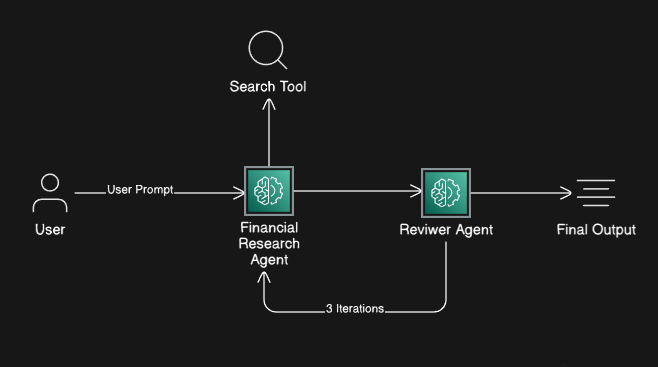
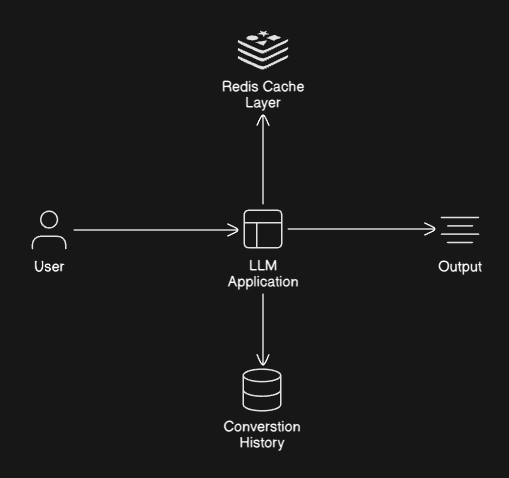

# Personal Financial AI Agent Assistant

> **🚧 Proof of Concept** - A multiagent AI system for personalized financial advice using LangChain and MCP tools.

## Overview

A **multiagent AI system** that combines specialized financial agents to deliver personalized financial advice. Each agent focuses on a specific domain and collaborates through LangChain's orchestration layer.

### 🤖 AI Agents

| Agent | Role | Status | Capabilities |
|-------|------|--------|--------------|
| 💼 Investment Agent | Specialist | ✅ Active | Portfolio recommendations, market analysis |
| 🔍 Review Agent | Quality Control | ✅ Active | Validates outputs, provides feedback, ensures consistency |
| 🎯 Supervisor Agent | Orchestrator | 🔄 In Development  | Routes queries, manages workflow, coordinates agents |
| 🤖 Generalist Agent | General Assistant | 📋 Planned | Handles general queries unrelated to finance, conversational support |
| 📊 Tax Specialist Agent | Specialist | 🔄 In Development | Tax optimization, deduction strategies |
| ⚠️ Risk Assessment Agent | Specialist | 📋 Planned | Risk evaluation, mitigation strategies |
| 💰 Budget Planner Agent | Specialist | 📋 Planned | Expense tracking, budget optimization |

**Technology:** LangChain → LangGraph (migration planned) • Model Context Protocol (MCP) • Python 3.11+

**Agent Flow:**
1. 🎯 **Supervisor** receives user query and determines intent
2. Routes to either:
   - 🤖 **Generalist Agent** → for general/non-financial questions
   - 💼 **Financial Specialists** → for financial queries (Investment, Tax, Risk, Budget)
3. 🔍 **Review Agent** validates all specialist outputs before returning to user

### 🔌 MCP Servers Integration
The system will leverage multiple MCP servers to extend functionality:

- **Web Search Server** 
  - Real-time market data and financial news retrieval
  - General web search for non-financial queries (Generalist Agent)
  - *Current*: Using LangChain Search tool
  - *Planned*: Migration to dedicated MCP Search server

- **File Data Server** *(planned)*
  - Excel/CSV file processing for user-provided portfolio data
  - Historical transaction analysis
  - Custom financial data imports

- **Database Server** *(planned)*
  - Persistent storage for user preferences and transaction history
  - Portfolio tracking across sessions
  - Historical performance data
  - Conversation history for context retention

### 💻 User Interface
- ~~**Current:** Command-line interface (CLI)~~
- **Current:** Streamlit-based chat UI
- **Next Phase:** Migration to React/Next.js for production-ready web application *(planned)*

## 🏗️ Architecture

### Current (v1.0 - LangChain POC)


**Flow:**
1. User submits financial query via CLI
2. **Investment Agent** performs analysis using Search tools
3. **Review Agent** validates output and provides feedback
4. Final verified response returned to user

**Current Tools:**
- LangChain Search (→ migrating to MCP Search Server)
- Basic CLI interface
- Basic Streamlit chat UI

### Planned (v2.0 - LangGraph + MCP)
#### Application View:

#### Architecture View:


**Enhanced Multi-Agent System Flow:**
1. User Query → **Supervisor Agent** 
2. Supervisor routes to appropriate agent:
   - 🤖 **Generalist Agent** (for general questions like "What's the weather?")
   - 💼 **Financial Agent** (represents Investment, Tax, Risk, Budget specialists)
3. Financial agent outputs → **Review Agent** for validation
4. Final Response → User

*Note: The "Financial Agent" shown in the diagram represents the suite of specialized financial agents (Investment, Tax, Risk, Budget) that will be implemented in the final version. The Generalist Agent handles non-financial queries and bypasses the review process.*

**Enhanced Multi-Agent System:**
- 🎯 **Supervisor/Orchestrator** - Routes queries, manages workflow
- 🤖 **Generalist Agent** - General conversational queries
- 💼 **Investment Agent** - Portfolio recommendations
- 📊 **Tax Specialist Agent** - Tax optimization
- ⚠️ **Risk Assessment Agent** - Risk evaluation
- 💰 **Budget Planner Agent** - Expense tracking
- 🔍 **Review Agent** - Quality control & feedback

**MCP Servers:**
- 🔍 Search MCP - Real-time market data & general web search
- 📊 File Data MCP - Excel/CSV processing
- 💾 Database MCP - Persistent storage

## 🚀 Quick Start

### Prerequisites
- **uv** - Python package and project manager
- Python 3.11+ 

### Installation
```bash
# Install uv
curl -LsSf https://astral.sh/uv/install.sh | sh

# Install dependencies
uv sync

# Run the CLI application
uv run driver.py

# Run user interface
.venv\Scripts\activate

streamlit run streamlit.py

# Run Streamlit UI (coming soon)
# uv run streamlit run app.py
```

## 🎯 Use Cases

### Financial Queries (Routed to Specialist Agents)
- "What are good investment options for ₹10,000?"
- "How can I optimize my tax deductions?"
- "Analyze the risk in my current portfolio"
- "Help me create a monthly budget of ₹3000"

### General Queries (Routed to Generalist Agent)
- "What's the weather forecast for tomorrow?"
- "Explain how machine learning works"
- "What are the latest technology news?"
- "Help me write a professional email"
- "What's the capital of France?"

## 📋 Roadmap

### Phase 1 - Foundation (Current)
- [x] ✅ Basic LangChain multiagent setup
- [x] ✅ Investment Agent implementation
- [x] ✅ Review Agent implementation
- [ ] 🔄 Supervisor Agent orchestration
- [ ] 🔄 Generalist Agent for non-financial queries
<!-- - [ ] 🔄 CLI interface enhancements -->

### Phase 2 - Enhanced Features
- [x] 📋 Streamlit chat UI
- [ ] 📋 MCP Web Search Server integration
- [ ] 📋 MCP File Data Server (Excel/CSV processing)
- [ ] 📋 Tax Specialist Agent
- [ ] 📋 Risk Assessment Agent
- [ ] 📋 Context-aware routing (Supervisor logic)

### Phase 3 - Production Ready
- [ ] 📋 Migration to LangGraph
- [ ] 📋 React/Next.js web application
- [ ] 📋 Database integration
- [ ] 📋 Budget Planner Agent
- [ ] 📋 Real-time market data integration
- [ ] 📋 Multi-turn conversation support

## 💻 Tech Stack

**Backend:**
- LangChain → LangGraph (migration planned)
- Model Context Protocol (MCP)
- Python 3.11+
- uv (package manager)

**Frontend:**
- ~~CLI (current)~~
- Streamlit (current)
- React/Next.js (planned)

## ⚠️ Current Limitations

- ~~CLI-only interface (Streamlit UI in development)~~
- No persistent memory between sessions
- Limited to basic investment advice
- No real-time market data
- Generalist Agent not yet implemented
- Supervisor routing logic in development
- No context retention across queries
<!--- Single-user focused-->

<!-- ## 📝 Example Usage

```text
# Financial query
$ uv run main.py
> What stocks should I invest in for long-term growth?
🔄 Routing to Investment Agent...
[Investment Agent performs analysis...]
🔍 Review Agent validating...
✅ [Verified investment recommendations provided]

# General query  
$ uv run main.py
> What's the capital of France?
🔄 Routing to Generalist Agent...
✅ Paris is the capital and largest city of France.
``` -->
<!-- ## 📞 Contact

*Add contact information* -->


